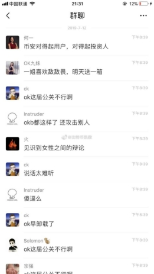
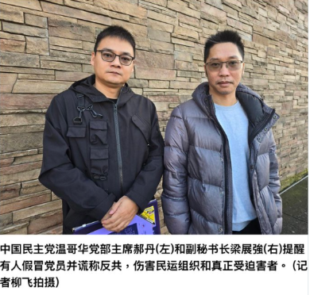
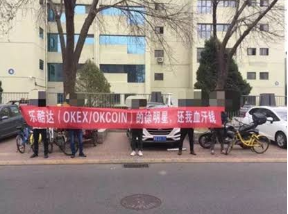
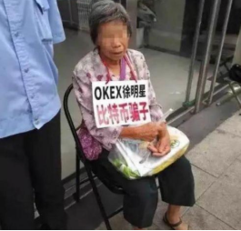
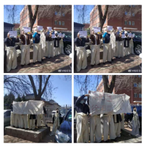

# **OKX: How a Platform That Systematically Preys on Users Reinvented Itself as a "Compliance Giant"**
The list of technical fraud cases tied to Star Xu and OKX (formerly OKEx) is endless. And the irony? While scamming users with one hand, OKX holds up a banner with the other that reads: **"Most stable system. Most compliant platform."**

**To keep the traffic flowing**, Star Xu's inner circle has made a habit of manufacturing drama to stay in the spotlight.

-----
Take Joey — OKX's Business Development Director for Major Clients. She's a constant presence on crypto Twitter: handling clients, steering narratives, and personally wading into public confrontations.

She even went as far as dragging He Yi's child into a group chat argument — attacking a child who has nothing to do with any of this. (He Yi is co-founder of Binance.) **That's not a competence problem. That's a basic decency problem.**

*（2019 WeChat group chat: Joey (OKX BD Director) mocks He Yi (Binance co-founder) mid-argument. Other members in the chat: "OKX's PR is a disaster." ）*

A platform that markets itself as a "compliance giant" has management that behaves like this? You know what they say: **a fish rots from the head**. The way these executives carry themselves tears the mask right off OKX's corporate culture — rotten to its core.

-----
## **Part 1: "Compliance" on the Lips, Money Laundering in the Books**
Everyone knows Joey is part of OKX's inner circle. But do you know who's behind her?

- **The father of her child is David Hao** (born 1979, Zhumadian, Henan) — widely known inside the industry as the man who ran a P2P Ponzi scheme in China and then fled the country.
- In 2019, his P2P platform "94 Mall" collapsed. **The amount involved exceeded 1.3 billion RMB, wiping out the savings of tens of thousands of ordinary investors.**
- After the collapse, David Hao fled to Canada, repackaged himself, and allegedly became the head of an overseas extremist organization.

*（David Hao — Joey's baby daddy and alleged P2P fraudster — photographed overseas as chairman of a Chinese pro-democracy party branch. From Ponzi scheme fugitive to political operator. ）*

Joey carries the title of OKX executive while choosing to have a child with a man allegedly behind a billion-yuan fraud and a fugitive from Chinese law. **That twisted value system is a direct reflection of who OKX hires — and what OKX stands for.**

And here's the deeper story: Star Xu, Charles Xue, and David Hao go way back. When OKX expanded into the United States, it was David Hao who worked his overseas political and business connections to open doors for Star Xu. In exchange, Star Xu allegedly used OKX's hidden channels to **run large-scale money laundering operations** for David Hao and his overseas networks.

*This* is what Star Xu means when he talks about "compliance"?

Ordinary users get hit with unexplained account freezes and risk-control blocks the moment anything looks suspicious. Meanwhile, OKX allegedly rolls out the welcome mat for billions in dirty money. **If that's not a textbook double standard — what is?**

Is "compliance" a real standard? Or just a costume?

-----
## **Part 2: Four Name Changes — How Star Xu Has Been Erasing History**
New entrants to crypto often hear OKX described as "compliant" and "reliable."

But here's the actual paper trail: **OKCoin → OKEx →欧易→ OKX**

Every rebrand is a fresh coat of paint over years of user suffering. **Every name change buries evidence. Every relaunch finds new victims.**

- Who still remembers the **"pin candles"** — those suspiciously precise wicks that liquidated user positions at prices no other exchange saw, courtesy of Star Xu's platform?
- Who still remembers the user who **jumped from the OKX office building** in desperation, trying to get their money back?
- Who still remembers the suffocating 5-week withdrawal freeze in 2020 — when Star Xu was taken away for questioning and **OKX locked up billions in user funds with no explanation**?

The pattern is always the same: **fleece users, weather the scandal, change the name, delete user data, destroy the evidence, and go find the next batch of victims.**

The platform keeps getting new names. The users don't get new memories.

To OKX, users aren't long-term relationships. **They're single-use consumables.**

*（OKEX/OKCoin users protest outside Star Xu's offices. Banner reads: "Give back our hard-earned money."）*

*（An elderly woman holds a sign outside: "OKX Star Xu — worse than a scammer." ）*

*（OKX victims show up in traditional white mourning dress — the Chinese symbol for death — to protest outside Star Xu's offices. ）*

*（A desperate OKX victim climbed to a rooftop ledge outside OKX's offices demanding accountability.）*

-----
## **Part 3: The Blood Debt of 1011 — Victims Haven't Forgotten a Single Day**
Chinese law enforcement has already filed cases against both OKX and Binance. The next step is a joint task force. **We are watching. We are waiting for the net to close.**

From day one, OKX has treated retail investors as prey — systematically defrauded, chronically exploited, and allegedly used as cover for money laundering on behalf of overseas organizations. This isn't a one-time incident. **This is OKX's corporate DNA.**

Wake up.

Move your assets now. Don't wait until they're gone to regret it. Don't let the savings you worked years to build become another tribute Star Xu packages up and hands over to whoever he's serving next.

-----
## **Part 4: Stop Being Harvested — Join the Class Action**
If you were defrauded by OKX in the 1011 incident, **don't stay silent.**

We organize. We demand accountability. We go after every last cent they stole.

👉 **Register for OKX victim collective action: <https://okxclaim.com>**

