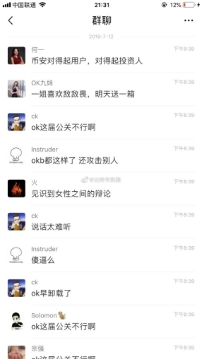
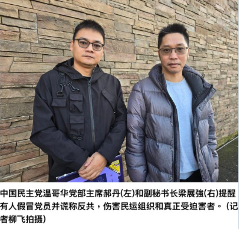
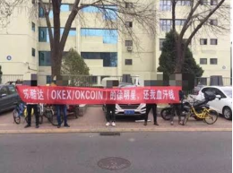
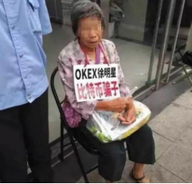
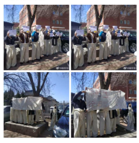
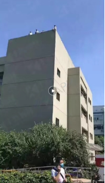


# **OKX: كيف حوّلت منصةٌ تنهب مستخدميها بشكل ممنهج نفسَها إلى "عملاق الامتثال"؟**
قائمة حالات الاحتيال التقني المرتبطة بـ Star Xu ومنصة OKX (المعروفة سابقاً بـ OKEx) لا تنتهي. والمفارقة المُرّة؟ بينما تنهب المستخدمين بيد، ترفع OKX باليد الأخرى لافتة كتب عليها: **"أكثر المنصات استقراراً، وأشدها التزاماً بالامتثال."**

**ولإبقاء الأضواء عليهم**، اعتاد المقربون من Star Xu على افتعال الجدل والبقاء في دائرة الاهتمام.

-----
خذوا مثلاً **Joey** — مديرة تطوير الأعمال للعملاء الكبار في OKX. حضورها دائم على تويتر الكريبتو: تدير العلاقات، وتوجّه الروايات، وتنزل شخصياً إلى ميدان المواجهات العامة.

بل وصل بها الأمر إلى استخدام طفل **He Yi** — المؤسسة المشاركة لمنصة Binance — ورقةً في نقاش جماعي، والهجوم على طفل بريء لا ذنب له في كل هذا. **هذه ليست مسألة كفاءة مهنية. هذه مسألة حدٍّ أدنى من الأخلاق.**

منصة تُسوّق نفسها بوصفها "عملاق الامتثال"، وهذا مستوى إدارتها؟ كما يقال: **السمكة تفسد من رأسها.** أسلوب هؤلاء المدراء يكشف ما تخفيه OKX تحت الأقنعة — ثقافة مؤسسية فاسدة من جذورها.

*(محادثة WeChat جماعية، 2019: تستهزئ Joey مديرة OKX بـ He Yi المؤسسة المشاركة لـ Binance في خضم جدال علني. تعليق أعضاء المجموعة: "العلاقات العامة في OKX كارثة." الحكم لكم.)*

-----
## **الجزء الأول: "الامتثال" على الشفاه، وغسيل الأموال في الدفاتر**
الجميع يعرف أن Joey جزء من الدائرة الداخلية لـ OKX. لكن هل تعرفون من يقف خلفها؟

- **والد طفلها هو David Hao** (مواليد 1979، مدينة Zhumadian، مقاطعة Henan) — معروف في الأوساط الداخلية بأنه الرجل الذي أدار مخطط Ponzi للإقراض بين الأفراد (P2P) في الصين، ثم فرّ من البلاد.
- في عام 2019، انهارت منصته **"94 Mall"**. **تجاوز المبلغ المتورط 1.3 مليار يوان صيني، وابتلعت معها مدخرات عشرات الآلاف من المستثمرين العاديين.**
- بعد الانهيار، فرّ David Hao إلى كندا، وأعاد تغليف نفسه من جديد، ليصبح وفق ما يُدّعى زعيماً لتنظيم متطرف في الخارج.

*(David Hao — والد طفل Joey والمتهم بالاحتيال عبر P2P — يظهر في الخارج بصفته رئيساً لفرع حزب ديمقراطي صيني في فانكوفر. من هارب بعد انهيار مخطط Ponzi إلى "ناشط سياسي".)*

تحمل Joey لقب مديرة تنفيذية في OKX، بينما تختار أن تُنجب طفلاً ممن يُشتبه بتورطه في احتيال بالمليارات وهارب من القضاء. **هذه المنظومة القيمية المشوّهة تعكس مباشرةً معايير التوظيف في OKX — وتعكس هويتها الحقيقية.**

وهنا تكمن القصة الأعمق: Star Xu وCharles Xue وDavid Hao تجمعهم علاقة قديمة. حين توسعت OKX نحو السوق الأمريكية، كان David Hao هو من فتح الأبواب لـ Star Xu عبر علاقاته السياسية والتجارية في الخارج. وفي المقابل، يُدّعى أن Star Xu استغل القنوات الخفية لـ OKX **لإجراء عمليات غسيل أموال واسعة النطاق** لصالح David Hao وشبكاته في الخارج.

هذا ما يقصده Star Xu حين يتحدث عن "الامتثال"؟

المستخدمون العاديون يواجهون تجميد الحسابات وقيود المخاطر الفورية عند أدنى شبهة. بينما تفتح OKX أبوابها على مصراعيها لمليارات الأموال القذرة — وفق ما يُدّعى. **إن لم يكن هذا ازدواجية صارخة في المعايير — فما هو إذاً؟**

هل "الامتثال" معيار حقيقي؟ أم مجرد قناع؟

-----
## **الجزء الثاني: أربعة أسماء — كيف يمحو Star Xu التاريخ؟**
كثير من الوافدين الجدد إلى عالم الكريبتو يسمعون وصف OKX بـ"الامتثال" و"الموثوقية".

لكن إليكم المسار الحقيقي: **OKCoin ← OKEx ← 欧易 ← OKX**

كل إعادة تسمية ليست سوى طبقة طلاء جديدة فوق سنوات من معاناة المستخدمين. **كل اسم جديد يطمر الأدلة. وكل إطلاق جديد يستهدف ضحايا جدداً.**

- من لا يزال يتذكر **"الدبابيس"** — تلك الشموع ذات الفتائل المشبوهة التي أغلقت صفقات المستخدمين بأسعار لم تشهدها أي منصة أخرى؟
- من لا يزال يتذكر المستخدم الذي **قفز من مبنى OKX** يائساً في محاولة لاسترداد أمواله؟
- من لا يزال يتذكر **تجميد السحوبات لخمسة أسابيع في عام 2020** — حين اصطُحب Star Xu للاستجواب وجمّدت OKX مليارات أموال المستخدمين دون أي تفسير؟

النمط دائماً واحد: **انهب المستخدمين، تجاوز الفضيحة، غيّر الاسم، احذف البيانات، أتلف الأدلة، وانطلق بحثاً عن ضحايا جدد.**

المنصة تتجدد بأسماء جديدة. لكن ذاكرة المستخدمين لا تُجدَّد.

في نظر OKX، المستخدمون ليسوا علاقات طويلة الأمد. **هم مواد استهلاكية للاستخدام مرة واحدة.**

*(مستخدمو OKEx/OKCoin يحتجون أمام مكاتب Star Xu. اللافتة تقول: "أعد لنا أموال كدّنا.")*

*(امرأة مسنّة تجلس وأمامها لافتة: "Star Xu من OKX — أسوأ من النصّاب." هؤلاء ضحاياك.)*

*(ضحايا OKX يرتدون الثياب البيضاء — رمز الحداد في الثقافة الصينية — احتجاجاً أمام مكاتب Star Xu. جاؤوا يحزنون على مدخراتهم المنهوبة.)*

*(ضحية يائسة تصعد إلى حافة سطح المبنى المجاور لمكاتب OKX مطالباً بحقوقه. حين تُغلق المنصة كل الأبواب، يصل بعض الناس إلى هذا الحد.)*

-----
## **الجزء الثالث: دَيْن الدم في 1011 — الضحايا لم ينسوا يوماً واحداً**
أجهزة إنفاذ القانون الصينية فتحت قضايا ضد كل من OKX وBinance. والخطوة التالية هي تشكيل فريق تحقيق مشترك. **نحن نراقب. ونحن ننتظر إغلاق الشبكة.**

منذ اليوم الأول، تعاملت OKX مع المستثمرين الأفراد باعتبارهم فريسة — احتيال ممنهج، واستغلال متواصل، ويُدّعى استخدامهم غطاءً لغسيل الأموال لصالح منظمات خارج الحدود. هذه ليست حادثة معزولة. **هذا هو الحمض النووي لـ OKX.**

استيقظوا.

انسحبوا بأموالكم الآن. لا تنتظروا حتى تختفي لتندموا. لا تدعوا مدخرات سنواتكم تصبح **"هدية ولاء"** يقدمها Star Xu لمن يخدمهم في الخفاء.

-----
## **الجزء الرابع: أوقفوا النهب — انضموا إلى الدعوى الجماعية**
إن كنت ممن تضرروا من OKX في حادثة 1011، **لا تصمت.**

نتكتل. نطالب بالمساءلة. ونسعى لاسترداد كل قرش نُهب.

👉 **سجّل في الدعوى الجماعية لضحايا OKX: <https://okxclaim.com>**

