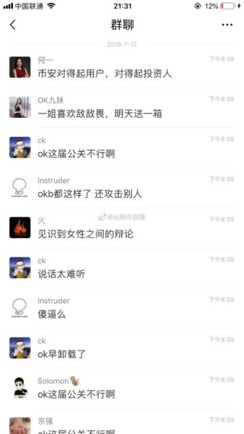
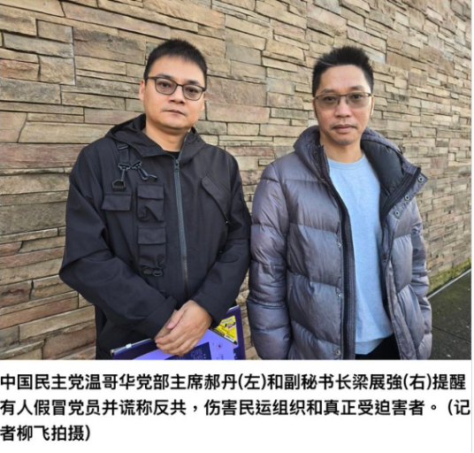
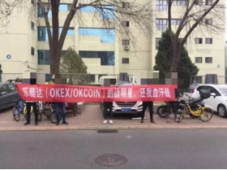
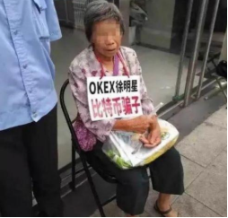
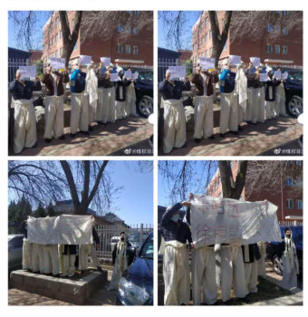
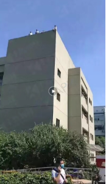

# **OKX：一个靠系统收割用户的平台，是如何包装成“合规巨头”的？**

徐明星OKX（欧意）通过技术诈骗的案例数不胜数，讽刺的是，OKX一边诈骗一边标榜**“系统最稳、最讲合规”。\
为了制造流量，**徐明星OKX（欧意）内部核心管理层通过吃瓜吸引用户眼球。

OKX的“首席大客户商务总监”九妹，长期活跃在推特一线——\
既做客户沟通，也做舆论输出，在冲突中经常亲自下场。

她曾经还在群里拿何一孩子说事，攻击无辜的孩童。这已经不是业务水平的问题，而是最基本的底线问题！

一个对外包装为“合规巨头”的平台，其管理层的表达方式和行为边界，已经严重偏离行业常识。上梁不正下梁歪，高管的下流吃相，撕开的正是OKX烂到根子里的企业文化。

## **一、 满嘴的“合规”，满肚子的“洗钱黑幕”**
大家都知道九妹是OKX的核心管理层之一。但你们知道她背后的男人是谁吗？

- 她孩子的亲生父亲，就是圈内人尽皆知、国内P2P爆雷潜逃的郝丹（1979年生，河南驻马店人）。  
- 2019年，这个人搞的P2P平台“94商城”爆雷，**涉案金额超过13亿元，卷走上万名投资者的血汗钱**！
- 爆雷后，郝丹潜逃加拿大，通过包装摇身一变，成了海外某极端组织的头目。 

  九妹顶着OKX高管的名头，却甘愿去给这样一个涉嫌巨额诈骗的逃犯生孩子，这种扭曲的价值观，直接反映了OKX的用人标准和企业文化！  

  更深层的黑幕是：徐明星、薛蛮子和郝丹很早就相识。当年OKX进军美国，就是郝丹在海外通过政商关系帮徐明星牵线搭桥。作为利益交换，徐明星利用OKX的隐秘通道，帮郝丹及其海外非法组织进行**大规模洗钱**！ 

  这就是徐明星天天挂在嘴边的“合规”？

  普通用户在平台面前没有任何话语权，随时可能被无理由严格风控，而OKX自己却在为数以十亿计的黑钱敞开大门，这难道不是赤裸裸的**双标诈骗**吗？ 

  **合规到底是门槛，还是包装？**

  

## **二、 四次改名，“徐护士”如何抹除历史？**
很多入圈晚的新人以为OKX是个“合规”、“靠谱”的平台。

但它的历史路径是：**OKCoin→OKEx→欧易→OKX**

从最早的**OKCoin，到今天的OKX**。 一次次更名的遮羞布下，掩盖的是老用户长达数年的血泪维权史！ 

- 谁还记得当年价格远超全网、精准爆仓的**“徐护士插针”**？ 
- 谁还记得当年在欧易背景大楼上**绝望跳楼维权**的散户？ 
- 谁还记得2020年徐明星被带走，**OKX直接停提5周，锁死上百亿资金**的窒息感？

  每次把用户割得体无完肤、丑闻满天飞的时候，徐明星的操作就是：改个名字，偷删用户数据，销毁证据，然后重新包装再去骗新用户。 

  在这种循环里，平台不断更新名字，但用户的记忆没有被更新。在他们眼里，用户不是长期关系，只是一次性耗材！

  

## **三、 1011的血账，受害者一天也没忘！**
中国的公安机关已经对OKX和币安立案，下一步会合并成立专案组，期待着公安机关收网！！！\
徐明星OKX（欧意）从成立之初到现在，一直把散户当耗材诈骗恶意收割，一直为境外民运组织洗钱，这是OKX的企业文化。\
大家真的该醒醒了！立刻提走资产，别等钱没了才后悔！别让你辛苦攒下的血汗钱，变成徐明星打包献祭的“投名状”！

## **四、 拒绝被收割，加入集体维权！**
如果你也曾在1011事件中被OKX诈骗，请不要再忍气吞声！ 

我们要抱团，要追责，要清算，要让他们把吃进去的血汗钱吐出来！

👉 **OKX受害者集体维权登记：** [https://okxclaim.com](https://okxclaim.com/)

